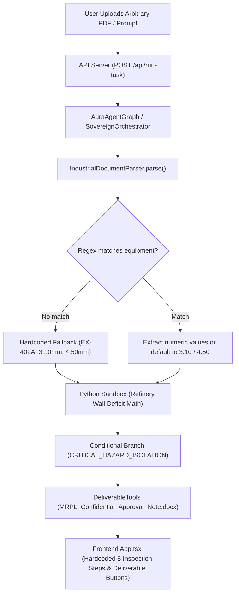

# AURA — COMPREHENSIVE FORENSIC AUDIT & ARCHITECTURAL REFACTORING SPECIFICATION

**Date:** 2026-09-30  
**Repository:** `Heuristics_SIH26117` / Agent Aamir  
**Target Organization:** Mangalore Refinery and Petrochemicals Limited (MRPL) / Enterprise On-Premise  
**Audit Goal:** Identify why all inputs default to industrial thickness/pipe analysis and define the General-Purpose Sovereign Multi-Task Agent architecture.

---

## 1. Executive Summary & Root Cause Analysis

AURA was originally constructed as a specialized demonstration pipeline for Smart India Hackathon (SIH 2026 Problem Statement 26117). While individual bug patches isolated per-run file storage (`output_deliverables/<runId>/`), the core agent orchestration graph, document parsing layer, state machine, and UI components remained **hardcoded around a single industrial refinery inspection workflow**.

When a user uploads a generic document (e.g., an SIH presentation PDF, Python script, or financial spreadsheet) or asks a general question (e.g., "What is recursion?"), **the system forces the input into the industrial inspection pipeline**, extracting non-existent equipment IDs, defaulting to wall thickness measurements (`3.10 mm` vs `4.50 mm`), calculating refinery shell deficits, and generating `MRPL_Confidential_Approval_Note.docx`.

### The Exact Root Cause Chain



#### Detailed Breakdown of Root Cause Files:

1. **`sovereign/document/document-parser.ts` (Lines 196–211)**:
   - Contains a hardcoded fallback if regex heuristics fail to find equipment tags in uploaded text:
     ```typescript
     if (findings.length === 0 && text.length > 50) {
         findings.push({
             equipmentId: "EX-402A",
             equipmentName: "Crude Pre-Heat Exchanger Shell",
             measuredValue: "Wall Thickness: 3.10 mm",
             allowableLimit: "Minimum Allowable (T-min): 4.50 mm",
             severity: "CRITICAL",
             recommendedAction: "Immediate isolation and shell replacement/weld overlay per MRPL SOP-MNT-2024-04."
         });
     }
     ```
   - **Impact:** Any uploaded document over 50 characters that is NOT an industrial inspection report triggers this fallback, generating `EX-402A` and `3.10 mm` thickness findings.

2. **`aura/document/industrial-doc.ts` (Lines 138 & 149)**:
   - Uses hardcoded defaults when parsing any file text:
     ```typescript
     let measuredNumeric = 3.10;
     let allowableNumeric = 4.50;
     ```
   - If regex does not find explicit `mm` values, it defaults to `3.10` and `4.50`. Since `3.10 < 4.50`, `severity` is unconditionally evaluated as `"CRITICAL"` and `recommendedAction` becomes `"Perform immediate isolation and execute shell segment weld overlay / replacement"`.

3. **`aura/core/state-graph.ts` (Lines 5–19 & 43)**:
   - State graph nodes are fixed around industrial inspection:
     `BRANCH_CRITICAL_HAZARD`, `BRANCH_NORMAL_MAINTENANCE`, `PROCESS_DOCUMENT`, `RETRIEVE_KNOWLEDGE`.
   - `conditionalBranchTaken` defaults to `"CRITICAL_HAZARD_ISOLATION"`.

4. **`aura/api/server.ts` & `sovereign/agent/sovereign-orchestrator.ts` (Lines 120–175)**:
   - `POST /api/run-task` executes a fixed 8-step sequence regardless of user prompt:
     1. Ingest document with `IndustrialDocumentParser`
     2. Search SOPs with `LocalKnowledgeRetriever`
     3. Execute Python refinery wall thickness script: `t_deficit = t_min - t_measured`
     4. Verify against SOP standards
     5. Generate `MRPL_Confidential_Approval_Note.docx`, `XLSX Inspection Sheet`, and `PPTX Deck`

5. **`todo-app/src/App.tsx` (Lines 80–88 & 301–310)**:
   - Hardcodes 8 initial UI execution timeline steps describing equipment findings, wall thickness calculation, SOP safety standards, and approval notes.
   - Frontend error catch block falls back to displaying:
     `CRITICAL DEFICIT: Wall thickness is below minimum allowable limit (T-min). IMMEDIATE ISOLATION AND WELD OVERLAY REQUIRED.`

---

## 2. Assessment of Current Subsystems

| Subsystem | Current State | Target State |
|---|---|---|
| **Agent Nature** | **Fixed Workflow Engine** pretending to be an agent | **Dynamic Multi-Task Agent** selecting skills, tools, and models based on user intent |
| **Task Routing** | Forced into 8-step industrial pipeline | Intent classification routing to 12+ distinct task handlers (General Q&A, Code, Debug, Test, PDF, DOCX, XLSX, Vision, Presentation, Industrial) |
| **Skill System** | Hardcoded inside `state-graph.ts` & `server.ts` | First-class `SkillRegistry` with contract metadata (`id`, `supportedInputs`, `requiredTools`, `models`) |
| **Tool System** | Hardcoded helper instances (`DeliverableTools`, `PythonSandboxTool`) | Dynamic `ToolRegistry` exposing standardized execution interfaces (`parse_pdf`, `execute_code`, `search_knowledge`, `create_docx`, `create_pptx`) |
| **RAG / Knowledge Base** | Single `LocalKnowledgeRetriever` scanning `demo-data` | Dual-Layer RAG: (1) Temporary Per-Run Task Uploads, (2) Persistent Enterprise Knowledge Base with full CRUD & indexing |
| **Model Router** | Simple route wrapper returning fixed provider | Dynamic capability discovery (`vision`, `text`, `reasoning`, `coding`) against Ollama `GET /api/tags` |
| **Deliverables / Output** | Unconditionally generates DOCX/XLSX/PPTX on every task | On-screen text/code responses by default; Artifact generation (DOCX, XLSX, PPTX, PDF) **ONLY when requested** |
| **Presentation (PPTX)** | Text dump onto fixed slide layout | Dedicated `PresentationSkill` for visual storytelling, layout planning, and slide structure |
| **Frontend UI** | Inspection-specific labels and buttons | Generic, adaptive task interface rendering dynamic timelines, code blocks, tables, and conditional download cards |

---

## 3. Recommended Target Architecture

```
                    ┌──────────────────────────────────────────┐
                    │               USER REQUEST               │
                    │   (Prompt + Optional File / Knowledge)   │
                    └────────────────────┬─────────────────────┘
                                         │
                                         ▼
                    ┌──────────────────────────────────────────┐
                    │            TASK UNDERSTANDING            │
                    │    (Intent Classifier & Input Parser)    │
                    └────────────────────┬─────────────────────┘
                                         │
                                         ▼
                    ┌──────────────────────────────────────────┐
                    │              PLANNER ENGINE              │
                    │     (Selects Skill, Tools, & Models)     │
                    └────────────────────┬─────────────────────┘
                                         │
        ┌────────────────────────────────┼────────────────────────────────┐
        │                                │                                │
        ▼                                ▼                                ▼
┌──────────────┐                 ┌──────────────┐                 ┌──────────────┐
│ GENERAL Q&A  │                 │  DEVELOPER   │                 │   DOCUMENT   │
│    SKILL     │                 │    SKILLS    │                 │   ANALYSIS   │
│ (Text answer)│                 │(Code/Debug/  │                 │  (PDF/DOCX/  │
└───────┬──────┘                 │    Test)     │                 │    XLSX)     │
        │                        └──────┬───────┘                 └──────┬───────┘
        │                               │                                │
        └────────────────────────────────┼────────────────────────────────┘
                                         │
                                         ▼
                    ┌──────────────────────────────────────────┐
                    │            AGENT EXECUTION LOOP          │
                    │    (Tool Calls, Model Reasoning, RAG)    │
                    └────────────────────┬─────────────────────┘
                                         │
                                         ▼
                    ┌──────────────────────────────────────────┐
                    │           VERIFICATION & OUTPUT          │
                    │  (On-Screen Response + Optional Artifact)│
                    └──────────────────────────────────────────┘
```

---

## 4. File Refactoring & Cleanup Plan

### Files to Delete / Supersede
- `sovereign/document/document-parser.ts` (replaces hardcoded `EX-402A` fallbacks with generic parser)
- `aura/demo/test-anti-hardcoding.ts` (replaced by comprehensive generic test matrix)

### Files to Refactor
- `aura/api/server.ts`: Replace fixed industrial pipeline with dynamic agent intent router.
- `aura/core/state-graph.ts`: Generalize `AuraState` and `AuraAgentGraph` to support dynamic steps.
- `aura/document/industrial-doc.ts`: Remove hardcoded `3.10` / `4.50` defaults; support generic PDF/DOCX/XLSX text & structure extraction.
- `aura/knowledge/local-retriever.ts`: Refactor into `PersistentKnowledgeBase` supporting CRUD operations and isolating run uploads from company RAG.
- `aura/tools/deliverable-tools.ts`: Refactor into modular artifact tools (`create_docx`, `create_xlsx`, `create_pptx`) invoked only when requested.
- `todo-app/src/App.tsx`: Generalize UI task prompt, timeline steps, skill displays, and output cards.

### Files to Add
- `aura/skills/skill-registry.ts`: First-class Skill Registry and Contract definitions.
- `aura/tools/tool-registry.ts`: Dynamic Tool Registry and execution wrappers.
- `aura/planner/task-planner.ts`: Intent classifier and execution plan generator.
- `aura/knowledge/company-knowledge.ts`: Persistent Enterprise RAG manager with CRUD.
- `aura/skills/presentation-skill.ts`: Dedicated visual presentation design engine for PPTX.
- `aura/tests/multi-task-agent.test.ts`: Comprehensive test matrix covering all 12 task capabilities.

---

## 5. Migration Strategy

1. **Phase 1**: Remove runtime fallbacks and hardcoded default constants.
2. **Phase 2**: Implement generic `AuraState`, `TaskPlanner`, `SkillRegistry`, and `ToolRegistry`.
3. **Phase 3**: Build `PersistentKnowledgeBase` with full CRUD operations and strict live upload isolation.
4. **Phase 4**: Implement specialized skills (General Q&A, Code, PDF/Document, Vision, Presentation, Industrial).
5. **Phase 5**: Update API server endpoints and refactor frontend `App.tsx` for adaptive UI task rendering.
6. **Phase 6**: Execute test matrix and verify 100% pass rate with zero cloud leaks.
